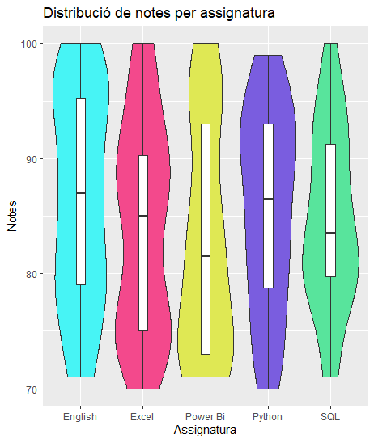

# ***Descripció dels fitxers:***

- Carpeta _Raw datasets_ --> Conté els datasets tal cual es descarreguen dels enllaços proporcionats per cada tècnica.

- Allivail_data_cleaned.csv --> Dades netejades fer representar el _alluvial diagram_

- Violin_data_cleaned.csv --> Dades netejades fer representar el _violin plot_

- build_violin_diagram.R --> Script que construeix i printa el diagrama de violí (amb les dades netejades).

- clean_alluvial_data.py --> Script per netejar el dataset del _alluvial diagram_

- clean_violin_data.py --> Script per netejar el dataset del _violin plot_

- violin_plot_png.png --> Diagrama de violí generat amb l'script .R

- README.md --> Fitxer amb tots els enllaços utilitzats en la realització de la PAC

# ***Estil de citació de les referències externes:***

- ISO 690

# ***Enllaç al perfil de Tableau Public on es podran veure totes les visualitzacions:***

[Enllaç al perfil de Tableau Public](https://public.tableau.com/app/profile/marc.cervera.rosell/vizzes)

# ***Alluvial Diagram:***

## Visualització:

[Enllaç a la visualització - Alluvial Diagram](https://public.tableau.com/app/profile/marc.cervera.rosell/viz/Diagramaalluvial-personesenedatdetreballarpersexeedaticiutadania-EuropadelSud/Hoja1)

## Dataset:

_ILOSTAT data explorer_ [en línia] [consulta: 31 d'octubre de 2025]. Disponible a: https://rshiny.ilo.org/dataexplorer42/?lang=en&segment=indicator&id=MST_XWAP_SEX_AGE_CCT_NB_A

## Referències externes (al codi - clean_alluvial_dapa.py):

[Ref.1] -- _pandas.read_csv_ [en línia] [consulta: 31 d'octubre de 2025]. Disponible a: https://pandas.pydata.org/docs/reference/api/pandas.read_csv.html

[Ref.2] -- _pandas.DataFrame.copy_ [en línia] [consulta: 31 d'octubre de 2025]. Disponible a: https://pandas.pydata.org/docs/reference/api/pandas.DataFrame.copy.html

[Ref. 3] -- _pandas.DataFrame.rename_ [en línia] [consulta: 31 d'octubre de 2025]. Disponible a: https://pandas.pydata.org/docs/reference/api/pandas.DataFrame.rename.html

[Ref. 4] -- _pandas.DataFrame.isnull_ [en línia] [consulta: 31 d'octubre de 2025]. Disponible a: https://pandas.pydata.org/docs/reference/api/pandas.DataFrame.isnull.html

[Ref. 5] -- _pandas.DataFrame.any_ [en línia] [consulta: 31 d'octubre de 2025]. Disponible a: https://pandas.pydata.org/docs/reference/api/pandas.DataFrame.any.html

[Ref. 6] -- _pandas.DataFrame.dropna_ [en línia] [consulta: 31 d'octubre de 2025]. Disponible a: https://pandas.pydata.org/docs/reference/api/pandas.DataFrame.dropna.html

[Ref. 7] -- _Pandas DataFrame: Replace Column Values (with code)_ [en línia] [consulta: 31 d'octubre de 2025]. Disponible a: https://favtutor.com/articles/pandas-replace-column-values/

[Ref. 8] -- _pandas.DataFrame.to_csv_ [en línia] [consulta: 31 d'octubre de 2025]. Disponible a: https://pandas.pydata.org/docs/reference/api/pandas.DataFrame.to_csv.html

# ***Violin plot:***

## Visualització:

## Dataset:

_Data Science Student Marks_ [en línia] [consulta: 1 de novembre de 2025]. Disponible a: https://www.kaggle.com/datasets/ayeshaimran123/data-science-student-marks

## Limitacions violin plot:

_Gráfico de Densidad_ [en línia] [consulta: 29 d'octubre de 2025]. Disponible a: https://datavizcatalogue.com/ES/metodos/grafico_de_densidad.html

_Kernel smoother_ [en línia] [consulta: 29 d'octubre de 2025]. Disponible a: https://en.wikipedia.org/wiki/Kernel\_smoother

# ***Dot Density Map:***

## Visualització:

[Enllaç a la visualització - Dot Density Map](https://public.tableau.com/app/profile/marc.cervera.rosell/viz/MapadepresnciadelacadenaHManivellmundial/MapapresenciaHMmundial)

## Dataset:

_H&M Stores Dataset (2022)_ [en línia] [consulta: 29 d'octubre de 2025]. Disponible a: https://www.kaggle.com/datasets/shivamb/hm-stores-dataset

## Referències externes (al codi - build_violin_diagram.R):

[Ref.9] -- _Seleccionar columnas en R con dplyr_ [en línia] [consulta: 1 de novembre de 2025]. Disponible a: https://r-coder.com/select-dplyr-en-r/

[Ref.10] -- _ggplot2 violin plot : Quick start guide - R software and data visualization_ [en línia] [consulta: 1 de novembre de 2025]. Disponible a: https://www.sthda.com/english/wiki/ggplot2-violin-plot-quick-start-guide-r-software-and-data-visualization

[Ref.11] -- _Modify axis, legend, and plot labels_ [en línia] [consulta: 1 de novembre de 2025]. Disponible a: https://ggplot2.tidyverse.org/reference/labs.html

## Links:

_Dot Distribution vs Graduated Symbols Maps_ [en línia] [consulta: 28 d'octubre de 2025]. Disponible a: https://gisgeography.com/dot-distribution-graduated-symbols-proportional-symbol-maps/#:~:text=One%20of%20the%20disadvantages%20of,dots%20for%20a%20large%20quantity.

_Dot density maps (dot maps)_ [en línia] [consulta: 28 d'octubre de 2025]. Disponible a: https://gis.depaul.edu/shwang/teaching/geo381/LN11.htm

_ALL YOU NEED TO KNOW ABOUT DOT MAPS_ [en línia] [consulta: 28 d'octubre de 2025]. Disponible a: https://www.linkedin.com/pulse/all-you-need-know-dot-maps-geography-point/

